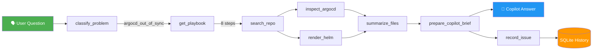
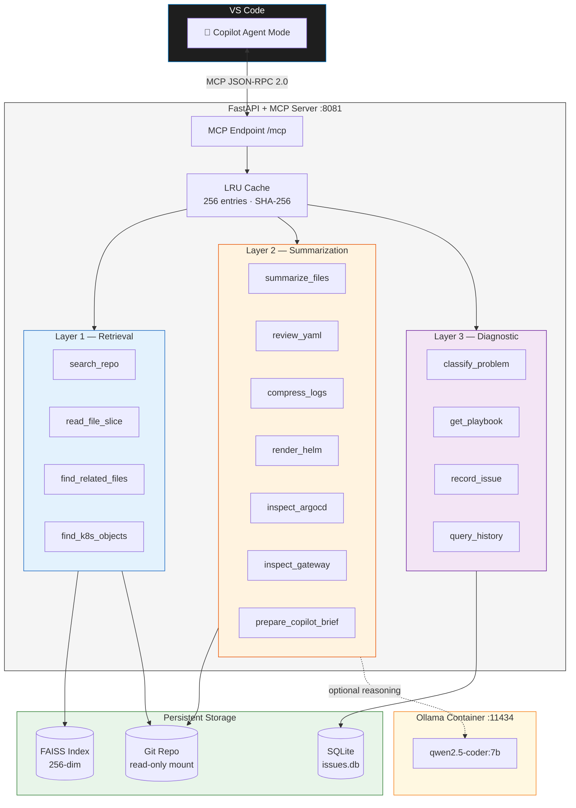
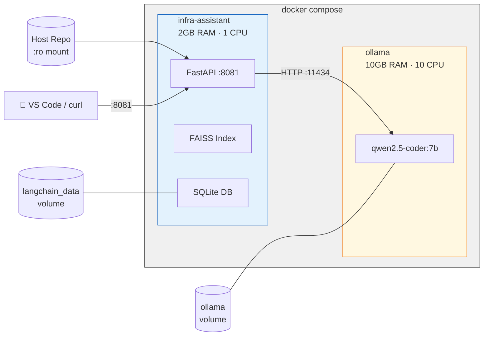
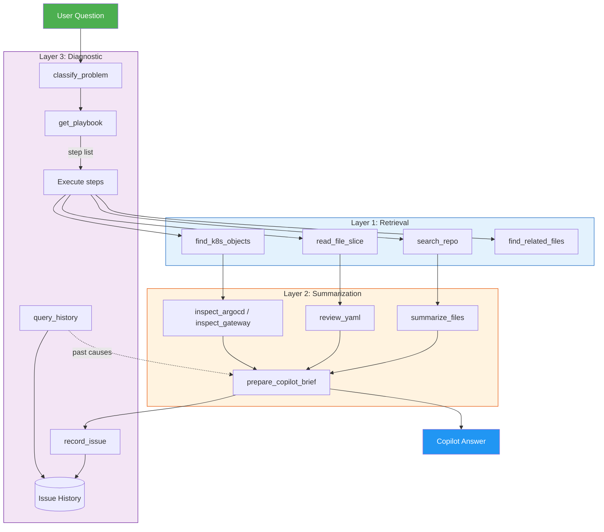

# Local Infra Assistant — MCP Server for Infrastructure Troubleshooting

## What Is This?

A local **Model Context Protocol (MCP)** server that gives VS Code Copilot deep awareness of your infrastructure repository — Helm charts, Kubernetes manifests, ArgoCD applications, Gateway API routes, and more.

Instead of copying YAML into chat and hoping the AI understands your cluster layout, this server indexes your GitOps repo and exposes 15 specialized tools that Copilot can call autonomously to search, read, summarize, and diagnose infrastructure problems.

The core idea: **Copilot becomes an infrastructure-aware pair programmer** that can look things up in your repo, follow troubleshooting playbooks, and learn from past issues — all running locally with no cloud dependencies beyond Ollama.

## What It Does

### Three-Layer Tool Architecture

The server organizes 15 MCP tools into three layers that work together:

**Layer 1 — Retrieval** (find and fetch)
| Tool | Purpose |
|---|---|
| `search_repo` | FAISS-indexed semantic search across the repo |
| `read_file_slice` | Read specific line ranges from files |
| `find_related_files` | Discover sibling manifests and configs |
| `find_k8s_objects` | Find K8s resources by kind/name/namespace |

**Layer 2 — Summarization** (compress and prepare)
| Tool | Purpose |
|---|---|
| `summarize_files` | Structured overview of multiple files |
| `review_yaml` | Detect hostname conflicts, Gateway misconfigs, LoadBalancer issues |
| `compress_logs` | Distill K8s/Tekton/ArgoCD logs into signals and suggestions |
| `render_helm` | Template a Helm chart and summarize produced objects |
| `inspect_argocd` | Check ArgoCD Application sync policy and drift risks |
| `inspect_gateway` | Inspect Gateway/HTTPRoute resources for broken refs |
| `prepare_copilot_brief` | Final handoff: package findings into a structured brief for Copilot |

**Layer 3 — Diagnostic** (classify, guide, remember)
| Tool | Purpose |
|---|---|
| `classify_problem` | Pattern-match text/logs against 11 known problem types |
| `get_playbook` | Get ordered troubleshooting steps for a detected pattern |
| `record_issue` | Save diagnostic sessions to persistent SQLite history |
| `query_history` | Surface past root causes and best tool order for a pattern |

### How Copilot Uses the Tools

When you ask "Why is Harbor out of sync in ArgoCD?", Copilot can autonomously:



1. **Classify** → `classify_problem` detects `argocd_out_of_sync` (confidence: 0.71)
2. **Get playbook** → `get_playbook` returns 8 ordered steps with common root causes
3. **Search** → `search_repo` finds ArgoCD Application manifests and Helm values
4. **Inspect** → `inspect_argocd` checks sync policy, `render_helm` compares chart output
5. **Summarize** → `summarize_files` compresses relevant files
6. **Brief** → `prepare_copilot_brief` packages everything into a structured handoff
7. **Record** → `record_issue` saves the session for future reference

### Performance Features

- **LRU content-hash cache** — repeated tool calls return in <1ms (86% hit rate in benchmarks)
- **Strict LLM prompts** — structured Summary/Details/Files output from Ollama
- **Smart output limits** — head+tail preview for large files, per-file and total character budgets
- **Verbosity modes** — compact (≤500 chars), normal (≤1500), detailed (≤5000)
- **Tuned Ollama settings** — temperature=0.1, repeat\_penalty=1.1 for deterministic output

## How to Use

### Prerequisites

- Docker and Docker Compose
- A Git repository with infrastructure code (Helm charts, K8s manifests, ArgoCD apps)
- Ollama runs inside Docker — no local GPU needed (CPU inference works)

### Quick Start

```sh
# Clone and start
git clone <this-repo>
cd MCP-server

# Point at your infra repo (or use the current directory)
export HOST_REPO_PATH=/path/to/your/gitops-repo

# Start the stack
docker compose up -d --build

# Pull the model (first time only)
docker exec ollama ollama pull qwen2.5-coder:7b

# Verify
curl -s http://127.0.0.1:8081/healthz | python3 -m json.tool
```

### Smoke Test

```sh
# List all 15 tools
curl -s http://127.0.0.1:8081/mcp \
  -H 'Content-Type: application/json' \
  -d '{"jsonrpc":"2.0","id":1,"method":"tools/list"}' \
  | python3 -c "import sys,json; [print(t['name']) for t in json.load(sys.stdin)['result']['tools']]"

# Classify a problem
curl -s http://127.0.0.1:8081/mcp \
  -H 'Content-Type: application/json' \
  -d '{"jsonrpc":"2.0","id":2,"method":"tools/call","params":{"name":"classify_problem","arguments":{"text":"pod CrashLoopBackOff exit code 137"}}}'

# Get the troubleshooting playbook
curl -s http://127.0.0.1:8081/mcp \
  -H 'Content-Type: application/json' \
  -d '{"jsonrpc":"2.0","id":3,"method":"tools/call","params":{"name":"get_playbook","arguments":{"pattern":"crashloop_backoff"}}}'
```

### Environment Variables

| Variable | Default | Description |
|---|---|---|
| `HOST_REPO_PATH` | `.` (current dir) | Host path to the repo to index (mounted read-only) |
| `REPO_PATH` | `/repo` | Container path for the indexed repo |
| `OLLAMA_MODEL` | `qwen2.5-coder:7b` | Model for optional LLM reasoning |
| `OLLAMA_BASE_URL` | `http://ollama:11434` | Ollama API URL |
| `ISSUE_DB_PATH` | `/app/data/issues.db` | SQLite path for issue memory |

### REST API

The server also exposes direct REST endpoints on port `8081`:

| Endpoint | Method | Description |
|---|---|---|
| `/healthz` | GET | Health check with repo index stats |
| `/models` | GET | List available Ollama models |
| `/search-repo` | POST | Search indexed repo |
| `/read-file-slice` | POST | Read file lines |
| `/find-related-files` | POST | Find sibling files |
| `/find-k8s-objects` | POST | Find K8s resources |
| `/summarize-files` | POST | Summarize files |
| `/review-yaml` | POST | Review YAML for issues |
| `/compress-logs` | POST | Compress logs |
| `/render-helm` | POST | Render Helm chart |
| `/inspect-argocd` | POST | Inspect ArgoCD apps |
| `/inspect-gateway` | POST | Inspect Gateway routes |
| `/prepare-copilot-brief` | POST | Build Copilot handoff brief |
| `/classify-problem` | POST | Classify problem pattern |
| `/get-playbook` | POST | Get troubleshooting playbook |
| `/record-issue` | POST | Record issue to history |
| `/query-history` | POST | Query past issues |
| `/ask-repo` | POST | LLM-powered repo Q&A |
| `/fullcontext` | POST | LLM reasoning with provided context |
| `/mcp` | POST | MCP JSON-RPC 2.0 endpoint |

## VS Code Integration

### Setup

1. Start the server (`docker compose up -d --build`)
2. Add `.vscode/mcp.json` to your workspace (already included):

```json
{
  "servers": {
    "local-infra-assistant": {
      "type": "http",
      "url": "http://127.0.0.1:8081/mcp"
    }
  }
}
```

3. In VS Code, open the Command Palette and run **MCP: List Servers**
4. Trust the `local-infra-assistant` workspace server
5. The 15 tools now appear in Copilot Chat — Copilot will call them automatically when relevant

### How It Looks in Practice

In Copilot Chat (Agent mode), ask infrastructure questions naturally:

- *"Why is the Harbor app out of sync in ArgoCD?"*
- *"What's wrong with this pod that keeps crashlooping?"*
- *"Check if the HTTPRoute for grafana has the right backendRef"*
- *"Review the Helm values for the tekton chart"*

Copilot will call the MCP tools, gather evidence from your repo, and provide grounded answers with file references.

## Pros and Cons

### Pros

- **Fully local** — no data leaves your machine. Repo content, logs, and issue history stay on disk. Suitable for air-gapped or security-sensitive environments.
- **Repo-grounded answers** — Copilot no longer guesses about your infrastructure. It searches your actual files, reads your actual manifests, and references real paths.
- **Structured troubleshooting** — 11 problem patterns with step-by-step playbooks mean Copilot follows a consistent diagnostic process instead of ad-hoc reasoning.
- **Persistent issue memory** — SQLite-backed history lets the system learn which root causes are common and which tool order works best. Answers improve over time.
- **Low resource overhead** — the assistant container runs with 2GB RAM and 1 CPU. Ollama handles the heavy LLM work separately.
- **No vendor lock-in** — built on open standards (MCP protocol, JSON-RPC 2.0, Ollama, FAISS). Swap models, switch editors, or extend tools without rewriting.
- **Works with any Git repo** — point `HOST_REPO_PATH` at any repo and the FAISS index rebuilds automatically on startup.
- **Performance-optimized** — LRU caching, character budgets, smart previews, and compact output modes keep token usage low and responses fast.

### Cons

- **No live cluster access** — the server indexes Git repos only. It cannot query running pods, live ArgoCD status, or cluster events. Cluster tool stubs are provided for future integration.
- **CPU-only LLM by default** — Ollama on CPU is slower than GPU. The 7B model works but larger models may be impractical without a GPU.
- **Pattern coverage is finite** — the classifier knows 11 problem types. Novel or unusual failure modes won't match any pattern and fall back to generic search.
- **Single-repo indexing** — the server indexes one repo at a time. Multi-repo setups require multiple instances or re-indexing.
- **Docker required** — the stack runs in Docker Compose. Native installation is possible but not documented.
- **Ollama model pull needed** — first startup requires downloading the model (~4GB), which takes time on slow connections.
- **MCP protocol maturity** — MCP is still evolving. Breaking changes in the protocol spec or VS Code's MCP client may require updates.

## Architecture

### System Overview



### Docker Compose Topology



### Three-Layer Tool Flow



## Running Tests

```sh
python3 -m pytest app/test_main.py -v
```

49 tests covering all three layers, REST endpoints, MCP tool calls, cache behavior, and issue memory.

## Additional Guides

- **[QUICK_START_SIMPLE.md](QUICK_START_SIMPLE.md)** — 3-step setup for first-time users
- **[COPILOT_MCP_OLLAMA_GUIDE.md](COPILOT_MCP_OLLAMA_GUIDE.md)** — detailed Copilot + MCP + Ollama integration guide
